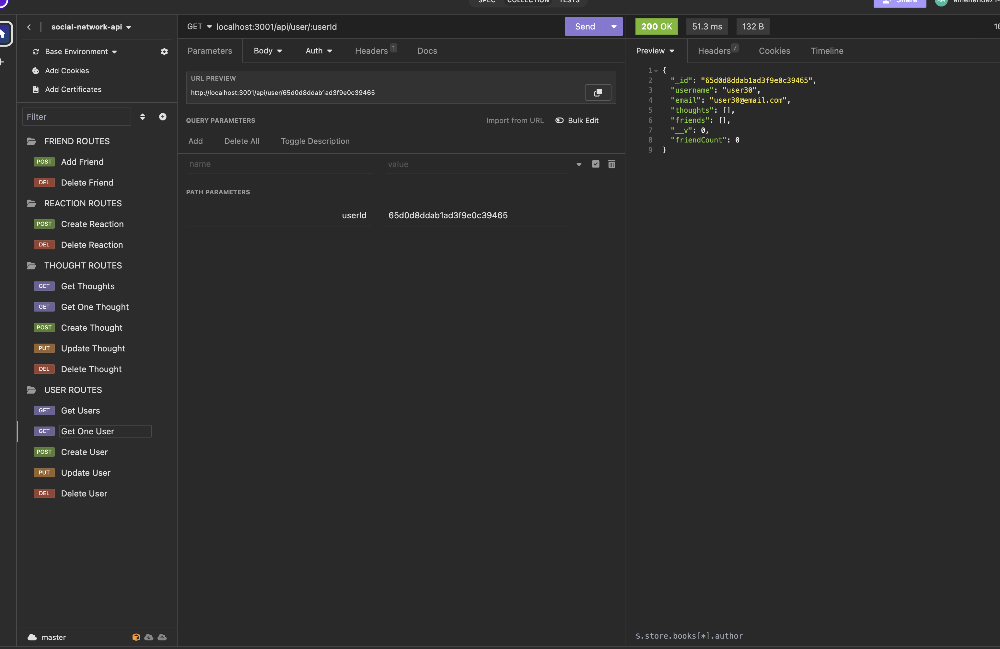

# Social Network API

This project aims to serve as a backend for a social media network with routes to handle users, friends, thoughts, and reactions. The backend can search, create, update, and delete users as well as add and remove a user to/from another user's friend list. In addition, it can search, create, update, and delete "thoughts" which serve as posts for users as well as add and delete user reactions to a "thought".

This project focused on using MongoDB as a database while utilizng Mongoose to make it much easier to create models, routes, and so on. Creating associations between different models felt a lot easier than my previvous experience using MySQL/Sequelize but I also enjoyed how simple the actual route creation was compared to previous projects. The thing i struggled with the most was working on the controllers and having discrepancies between the way things were named in my models vs my controllers and making sure they matched up. Overall this project helped me have a better understanding of database and backend connections. 

## Usage
[Demo Video](https://drive.google.com/file/d/1yHyg8KZZEsx-Kvhu2Spx0NQMGTkTSH6g/view)
 
 

## Code Source
[Repository](https://github.com/alexismenendez/amenendez-social-network-api)

## Resources & Assets
[Express](https://www.npmjs.com/package/express) 
[Mongoose](https://www.npmjs.com/package/mongoose) 
[MongoDB](https://www.mongodb.com/) 
[Nodemon](https://www.npmjs.com/package/nodemon) 
[Insomnia](https://insomnia.rest/) 